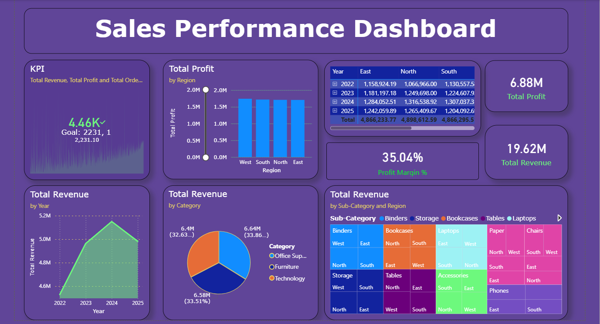

# 📊 Smart Sales Analytics & Forecasting Project

## 📌 Project Overview

This project performs end-to-end Sales Data Analysis and Revenue Forecasting using Python and Power BI.

The objective is to analyze historical sales data, generate business insights, and forecast future sales trends using Machine Learning techniques.

---

## 🔗 Project Resources

- 📂 GitHub Repository:  
  https://github.com/mangeshnersekar44-web/sales-performance-analysis-python-powerbi

- 💻 Python Code:  
  https://github.com/mangeshnersekar44-web/sales-performance-analysis-python-powerbi/blob/main/mini%20project1.py

- 📁 Dataset (CSV File):  
  https://github.com/mangeshnersekar44-web/sales-performance-analysis-python-powerbi/blob/main/sales_dataset.csv

---

## 🎯 Business Objectives

- Analyze revenue by region and category
- Identify monthly sales trends
- Evaluate product-level performance
- Measure category contribution to total revenue
- Forecast next 6 months sales using Linear Regression

---

## 🛠 Tools & Technologies Used

- Python
- Pandas
- NumPy
- Matplotlib
- Seaborn
- Scikit-learn (Linear Regression)
- Power BI

---

## 📂 Project Workflow

### 1️⃣ Data Cleaning & Preprocessing
- Converted `Order Date` to datetime format
- Handled missing values
- Removed null records
- Created new time-based features (Month, Year, Quarter)

### 2️⃣ Feature Engineering
- Created Revenue column
- Generated time index for forecasting
- Aggregated monthly revenue

### 3️⃣ Exploratory Data Analysis (EDA)
- Revenue by Region (Bar Chart)
- Monthly Sales Trend (Line Chart)
- Product vs Region Heatmap
- Revenue Share by Category (Pie Chart)

### 4️⃣ Sales Forecasting (Machine Learning)
- Used Linear Regression model
- Time-series aware train-test split (no shuffle)
- Evaluated using:
  - R² Score
  - RMSE
- Forecasted revenue for next 6 months

---

## 📈 Model Evaluation

The model performance is measured using:

- **R² Score**
- **Root Mean Squared Error (RMSE)**

These metrics evaluate how well the model predicts future revenue trends.

---

## 🔮 Future Forecast

The project predicts the next 6 months of revenue using a trained Linear Regression model based on historical monthly sales trends.

---

## 📊 Power BI Dashboard Preview

The dashboard includes:

- KPI Cards (Total Revenue, Total Profit, Profit Margin)
- Revenue by Year
- Revenue by Category
- Revenue by Sub-Category & Region
- Regional Profit Analysis

### Dashboard Screenshot:

---

## 🚀 How to Run the Project

### Step 1: Clone Repository
